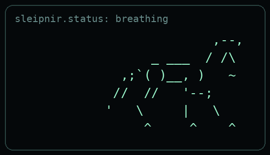

<!--
Static GitHub profile README for Rakibuzzaman Rahat.
Hybrid direction: Boot Sequence + Man Page + Source Code.
No badges, no stats cards, no visitor counters, no emoji spam.
-->

<p align="center">
  
</p>

# RAKIBUZZAMAN-RAHAT(1)

```text
booting profile...
identity        materials engineer / AI builder / indie game developer
base            Dhaka -> Aachen
current work    scientific tools, automation systems, small playable things
operating mode  quiet interface, useful output, no unnecessary noise
```

## NAME

**Rakibuzzaman Rahat** - materials engineer, AI/software builder, and indie game developer.

## SYNOPSIS

```text
rahat [--materials] [--ai-systems] [--automation] [--games]
```

## DESCRIPTION

I build across three connected spaces: materials engineering, software systems, and playable interaction.

The common thread is structure. In research, structure turns papers and experiments into usable knowledge. In automation, structure turns repeated work into reliable workflows. In games, structure turns rules into experience.

I care about tools that are clear, useful, and intentionally made.

## CURRENT FOCUS

```python
current_focus = [
    "scientific data extraction",
    "retrieval and agent workflows",
    "automation for practical work",
    "small games and interaction experiments",
]
```

## PROJECTS

```python
projects = {
    "boighor": {
        "link": "https://boighorlibrary.com",
        "kind": "digital lending library",
        "note": "access to books should be simple",
    },
    "palimpsest": {
        "link": "https://github.com/sleipnir029/palimpsest",
        "kind": "scientific extraction agent",
        "note": "papers become structured, provenance-aware data",
    },
    "supplementary_bot": {
        "link": "https://github.com/sleipnir029/supplementary-Bot",
        "kind": "automation experiment",
        "note": "trends, Wikipedia, and a daily knowledge loop",
    },
    "ontelya": {
        "link": "https://ontelya.com",
        "kind": "research data platform",
        "note": "scientific PDFs to verified datasets",
    },
}
```

### [Boighor](https://boighorlibrary.com)

A free digital lending library built for access, reading, and simple borrowing flows.

### [Palimpsest](https://github.com/sleipnir029/palimpsest)

A Python agent for extracting structured, ontology-aligned data from PEM electrolyzer and OER catalyst research papers.

### [supplementary-Bot](https://github.com/sleipnir029/supplementary-Bot)

A compact automation project that retrieves Google Trends data, finds related Wikipedia articles, and posts daily knowledge fragments.

### [Ontelya](https://ontelya.com)

A scientific PDF extraction platform focused on structured datasets, confidence scoring, human review, and source provenance.

## METHOD

```text
input      unclear problem, scattered data, unfinished idea
process    constrain -> prototype -> verify -> refine
output     something small enough to ship, useful enough to keep
```

```python
class WorkingStyle:
    goal = "make complex systems easier to use"
    taste = "quiet interfaces, strong structure, useful output"

    def build(self):
        return "constrain, prototype, verify, refine"
```

## SEE ALSO

[website](https://rzaman.site) / [itch.io](https://zeezbitstudios.itch.io) / [bluesky](https://bsky.app/profile/sleipnir029.bsky.social)

<!-- hidden line: the useful thing should survive the aesthetic -->
